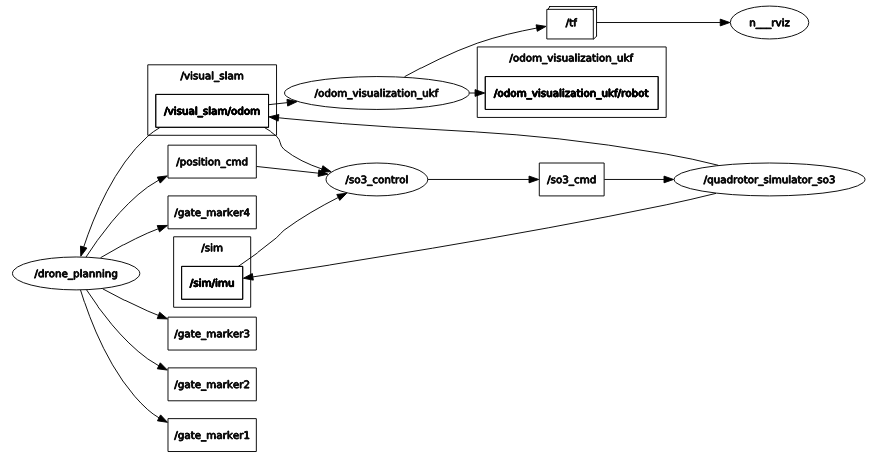

# CPPND: Capstone-Autonomous FPV Simulation

## File and class structure

The code is tested on ROS (melodic) under ubuntu 18.04. All the ROS packages are stored in the `src` folder.  The `so3_quadrotor_simulator` is the simulation package, which is copied from the [HKUST-Aerial-Robotics](https://github.com/HKUST-Aerial-Robotics/Fast-Planner) . The `drone_planning` has two functions:  1. the simulation of the gates' movement.  2. the trajectory planning according to the detected position of gates.  The trajectory generation in this package is realized by [a optimal controller](https://github.com/markwmuller/RapidQuadrocopterTrajectories) and the related files are `RapidTrajectoryGenerator.cpp` and `SingleAxisTrajectory.cpp`. The `so3_control` contains a nodelet subscribing the position command topic published by the `drone_planning` node and transmits these command to so3 command that can be followed by the drone to the `so3_quadrotor_simulator` node.  The rqt_graph of the overall simulation is:

There are three main classes:   `Gate`,`TrajectoryServer` and `SO3ControlNodelet`.  

- The `Gate` class simulates the movement of the gate. Once the gate is locked by the drone as a target , the position of the gate is predicted for the trajectory calculation. 
- The `TrajectoryServer` dynamically generates the desired trajectory according to the real-time position of the drone and the targeted gate position. All the moving gates are also launched in this class in multiple threads.
- The `SO3ControlNodelet` is a inherited ROS nodelet class to publish the so3_command to the drone model.

## Project Rubrics

